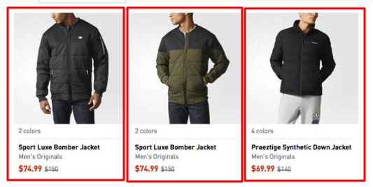
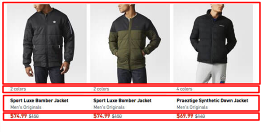

# HTML

1. [Семантика](#1)
2. [Теги](#2)
3. [Подключаемые файлы](#3)

<a name="1"></a>

## Семантика

<a name="1.1"></a>

- [1.1](#1.1) Объединять блоки не по их визуальному расположению, а по их смыслу.

  Объединяем блоки вот так:  
  

  А не вот так:  
  .  
  Как минимум, это очень легко позволит потом добавить новый элемент. Плюс второй подход очень неудобен, если контент генерируется динамически.

<a name="1.2"></a>

- [1.2](#1.2) Если есть что-то похожее на список, проверяем, как будет выглядеть при большем количестве элементов.

<a name="1.3"></a>

- [1.3](#1.3) Все элементы с текстом, контент которых формируется динамически, проверяем на то, чтобы они не ломались при большем количестве текста, чем на макете.

  Проверять, как при большом кол-ве текста из отдельных слов, так и при сплошном тексте.

<a name="1.4"></a>

- [1.4](#1.4) Не вставлять инлайновые элементы(элементы с `display: inline`) внутрь блочных.

  Никаких `<span><div></div></span>`.

<a name="1.5"></a>

- [1.5](#1.5) Всегда указывать атрибут `alt` для тега ``.

<a name="1.6"></a>

- [1.6](#1.6) Использовать h1..h6 только для заголовков, причем h1 должен встречаться в одной странице всего один раз.

<a name="1.7"></a>

- [1.7](#1.7) Использовать `<table>` только для реальных таблиц.

  Если перед таблицей есть её текстовое описание, сделать это внутри тега `<table>` через `<caption>`.  
  Если у таблицы первая строка идет заголовком, то использовать `<thead>` и вложенные `<th>` для этого и использовать "scope" для этих ячеек.

  Пример:

  ```html
  <table>
    <caption>
      First two U.S. presidents
    </caption>
    <thead>
      <tr>
        <th scope="col">Name</th>
        <th scope="col">Took office</th>
        <th scope="col">Party</th>
      </tr>
    </thead>
    <tbody>
      <tr>
        <td>George Washington</td>
        <td>April 30, 1789</td>
        <td>n/a</td>
      </tr>
      <tr>
        <td>John Adams</td>
        <td>March 4, 1797</td>
        <td>Federalist</td>
      </tr>
    </tbody>
  </table>
  ```

<a name="1.7"></a>

- [1.7](#1.7) Использовать семантические теги.

  Почему их нужно использовать, узнать можно [здесь](https://www.youtube.com/watch?v=bDYEnNzprzE) и [здесь](https://developer.mozilla.org/ru/docs/Learn/%D0%94%D0%BE%D1%81%D1%82%D1%83%D0%BF%D0%BD%D0%BE%D1%81%D1%82%D1%8C/HTML).  
  [Блок-схема](http://html5doctor.com/downloads/h5d-sectioning-flowchart.pdf) для выбора семантических тегов.

  
<a name="2"></a>

## Теги

<a name="2.1"></a>

- [2.1](#2.1) Все теги должны работать даже без CSS и JS.

  Все тексты, видимые сначала при открытии страницы так же должны быть доступны, формы должны сабмититься, ссылки должны переходить (а ссылки, по которым вообще не должно быть перехода и для которых принято ставить `href="#"`, вообще не использовать, это будет далее).

<a name="2.2"></a>

- [2.2](#2.2) В `head` добавлять `<meta name="viewport" content="initial-scale=1.0, width=device-width">` — на мобильных браузерах можно избежать горизонтального скролла и масштабировать контент на всю ширину экрана.

<a name="2.3"></a>

- [2.3](#2.3) Не использовать id, кроме случаев, когда они семантически востребованы.

  Когда гарантируется их уникальность, например, на уровне базы данных и когда вам нужно:

  - сделать рабочую навигацию в рамках одной страницы (например, как на Википедии или на этом сайте сборника [best-practices](https://isobar-idev.github.io/code-standards/#javascript_javascript).
  - связать `<label>` и `<input />`, которые находятся в совершенно разных ветках дерева DOM (вообще, лучше всегда просто `<input />` внутрь `<label>` ставить, и тогда никакие айдишники не нужны).

<a name="2.4"></a>

- [2.4](#2.4) Избегать по максимуму инлайновые стили.


<a name="2.5"></a>

- [2.5](#2.5) Ссылки на чужие сайты должны содержать атрибут `target="_blank"`, чтобы открываться в новом окне.

  Это связано с [уязвимостью](https://mathiasbynens.github.io/rel-noopener/), в соответствии с которой сайт, который вы открыли, получит доступ к сайту, с которого перешли через `window.opener`, причем это работает даже кроссдоменно.

<a name="2.6"></a>

- [2.6](#2.6) Если у поля есть четкое назначение, то использовать соответствующий тип (email, number, color и т. д.).

<a name="2.7"></a>

- [2.7](#2.7) Классические инлайн теги должны быть только inline или inline-block, и в них не должно быть ничего, кроме простого текста и других таких же инлайновых тегов.

  Исключения: `<a>` — иногда ссылку надо сделать блочным элементом, но лучше использовать inline-block.

<a name="2.8"></a>

- [2.8](#2.8) Для телефонов, емайл-адресов и скайп никнеймов нужно использовать `<a>` c соответствующим адресом.

  ```html
  <a href="tel: +74951234567">+7 (495) 123-45-67</a>
  <a href="mailto: example@mail.ru">example@mail.ru</a>
  <a href="skype: someskype?call">someskype</a>
  ```

<a name="3"></a>

## Подключаемые файлы


<a name="3.1"></a>

- [3.1](#3.1) Все картинки, шрифты и т. д. должны иметь уникальное название в рамках проекта и не содержать кириллических символов. Должны именоваться в стиле lower-case-hyphenated.


<a name="3.2"></a>

- [3.2](#3.2) Прогонять картинки через [kraken.io](https://kraken.io/) или использовать свои CLI-утилиты для этого.

<a name="3.3"></a>

- [3.3](#3.3) Все фотографии и картинки, где нет прозрачности, делать в jpg.

